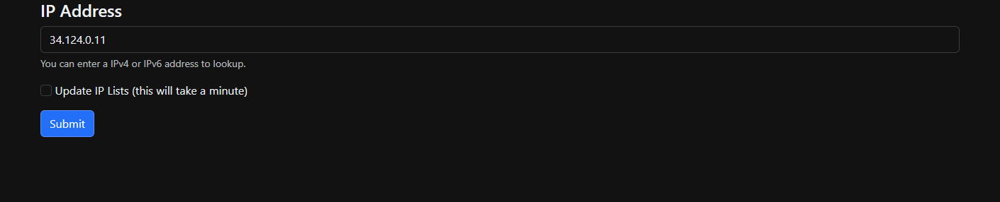
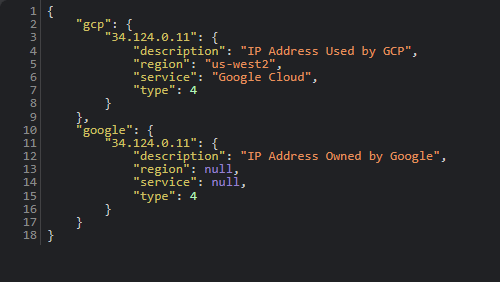

### CloudFinderWeb

Been trying to find a full solution that works for checking if a IP address is part of a Cloud Service Provider.

This stands up a simple web page to submit a IP address and optionally update all the lists below.

#### Services so far:
* AWS
* GCP
* Cloudflare
* Fastly
* OCI
* Linode
* GitHub
* DigitalOcean
* Akamai
* Microsoft Azure
* Microsoft O365
* IBM Cloud
* Zscaler

#### Example
Submit IP address to check:

Response

 This work is licensed under a <a rel="license" href="http://creativecommons.org/licenses/by-sa/4.0/">Creative Commons Attribution-ShareAlike 4.0 International License</a>.
