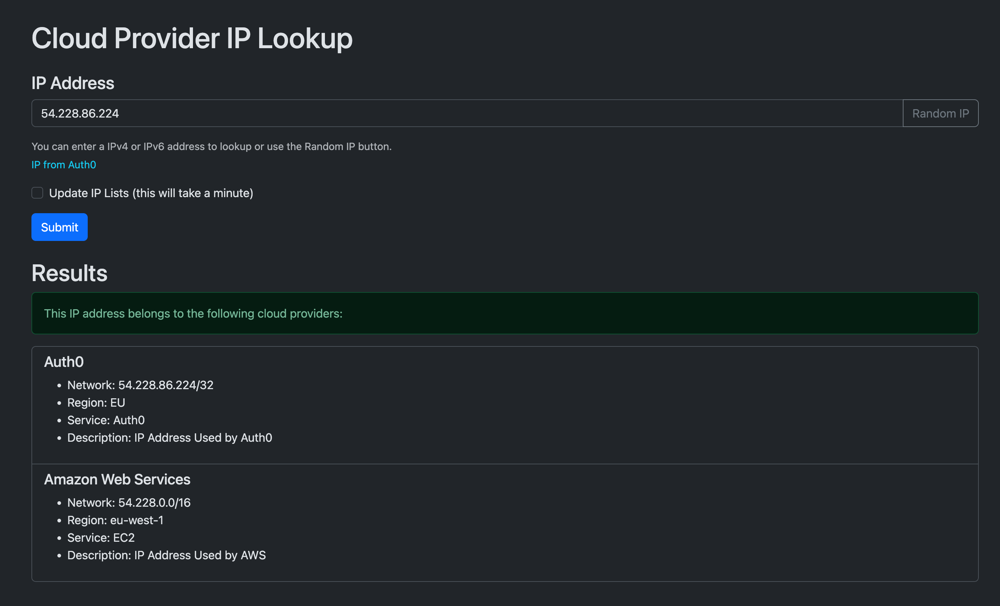

# CloudFinderWeb

A high-performance web application for checking if an IP address belongs to a cloud service provider, with support for 19+ major cloud providers.

## Features

- 🚀 **Fast IP Lookups** - Efficient IP range matching using optimized data structures
- 🌐 **23+ Cloud Providers** - Comprehensive coverage of major cloud infrastructure
- 🔄 **Auto-Update** - Fetch latest IP ranges directly from cloud provider APIs
- 🎯 **RESTful API** - Programmatic access to IP lookup functionality
- 💻 **Modern Web UI** - Clean, responsive interface with Bootstrap 5
- ⚡ **Async Processing** - Parallel updates for all cloud providers
- 🐳 **Docker Support** - Easy deployment with Docker and Docker Compose
- 🧠 **MCP Server** - FastMCP integration for AI assistant compatibility

## Supported Cloud Providers

* AWS (Amazon Web Services)
* Google Cloud Platform
* Microsoft Azure (Public, China, Government, Germany)
* Auth0
* Salesforce
* Atlassian
* Elastic Cloud
* Zoom
* Cloudflare
* GitHub
* DigitalOcean
* Akamai
* Microsoft Office 365
* IBM Cloud
* Oracle Cloud Infrastructure (OCI)
* Linode
* Fastly
* Zscaler

## Installation

### Prerequisites

* Python 3.11 or higher
* uv package manager (preferred) or pip

### Setup with uv (Recommended)

```bash
# Clone the repository
git clone https://github.com/yourusername/CloudFinderWeb.git
cd CloudFinderWeb

# Create virtual environment with Python 3.12
uv venv -p 3.12

# Activate virtual environment
source .venv/bin/activate  # On Windows: .venv\Scripts\activate

# Install dependencies
uv pip install -e .
```

### Setup with pip

```bash
# Clone the repository
git clone https://github.com/yourusername/CloudFinderWeb.git
cd CloudFinderWeb

# Create virtual environment
python -m venv .venv

# Activate virtual environment
source .venv/bin/activate  # On Windows: .venv\Scripts\activate

# Install dependencies
pip install -e .
```

## Usage

### Running the Application

#### Development Mode
```bash
python test_run.py
```
Access the application at http://localhost:5050

#### Production Mode with Gunicorn (Unix/Linux/macOS)
```bash
gunicorn -b 127.0.0.1:5050 -w 4 "cloudfinderweb:create_app()"
```

#### Docker Deployment
```bash
# Build and start services
docker-compose up -d

# View logs
docker-compose logs -f

# Stop services
docker-compose down
```

### Using the Web Interface

1. Navigate to http://localhost:5050
2. Enter an IP address (IPv4 or IPv6)
3. Optionally check "Update IP Lists" to fetch the latest data
4. Click Submit

### Using the API

#### Check an IP address
```bash
curl -X POST http://localhost:5050/api/lookup \
  -H "Content-Type: application/json" \
  -d '{"ip": "52.94.76.5"}'
```

#### List all providers
```bash
curl http://localhost:5050/api/providers
```

#### Update all provider data
```bash
curl -X POST http://localhost:5050/api/update
```

#### Get a random IP from cloud providers
```bash
curl -X GET http://localhost:5050/api/random-ip
```

### Using the MCP Server

The MCP Server runs on port 5051 and provides an interface compatible with AI assistants using the FastMCP protocol.

```bash
# Start the MCP server
python cloudfinder_mcp.py
```

Available tools via MCP:
- `is_cloud_ip`: Simple check if an IP belongs to a cloud provider
- `get_cloud_ip_details`: Detailed information about an IP address
- `get_random_cloud_ip`: Get a random IP from cloud provider ranges
- `update_cloud_ips`: Update the cached cloud provider IP data

## Examples

### Web Interface Demo

Submit an IP address to check:



## Project Structure

```
CloudFinderWeb/
├── cloudfinderweb/           # Main application package
│   ├── app/                  # Application code
│   │   ├── api/             # API routes
│   │   ├── models/          # Data models
│   │   ├── providers/       # Cloud provider implementations
│   │   ├── utils/           # Utility functions
│   │   └── web/             # Web interface routes
│   ├── config/              # Configuration files
│   ├── static/              # Static assets (CSS, JS, images)
│   ├── templates/           # HTML templates
│   └── clouds/              # Cached cloud provider IP data
├── tests/                   # Test suite
├── cloudfinder_mcp.py       # MCP server for AI assistant integration
├── Dockerfile               # Docker container definition
├── docker-compose.yml       # Multi-container Docker setup
├── pyproject.toml           # Python project configuration
├── README.md                # This file
└── LICENSE                  # License information
```

## Testing

Run the test suite:

```bash
python tests/run_tests.py
```

## Development

### Adding a New Cloud Provider

1. Create a new provider class in `cloudfinderweb/app/providers/`
2. Inherit from `CloudProvider` base class
3. Implement the `fetch_ip_ranges()` method
4. Register the provider in `cloudfinderweb/app/providers/__init__.py`

Example:
```python
from .base import CloudProvider

class MyProvider(CloudProvider):
    def __init__(self):
        super().__init__("my_provider", "My Provider Name")
        self.api_url = "https://api.myprovider.com/ip-ranges"

    async def fetch_ip_ranges(self) -> bool:
        # Implementation here
        pass
```

### API Documentation

The application provides a RESTful API with the following endpoints:

* `POST /api/lookup` - Look up an IP address
* `GET /api/providers` - List all cloud providers
* `POST /api/update` - Update IP ranges for all providers

### Configuration

Configuration settings are located in `cloudfinderweb/config/config.py`. You can customize:

* API timeouts
* Update lock timeouts
* Cloud provider URLs
* Cache directories
* Flask settings

## Performance

The application uses several optimizations:

* **Efficient IP Lookup**: Uses pre-computed IP network objects for fast matching
* **Async Updates**: All cloud providers update in parallel
* **Caching**: IP ranges are cached locally to reduce API calls
* **File Locking**: Prevents duplicate update operations when using multiple workers
* **Modular Architecture**: Clean separation of concerns for maintainability
* **Docker Support**: Easy deployment in containerized environments
* **MCP Integration**: Compatible with AI assistants via FastMCP protocol

## Known Limitations

* Some DNS service IPs (like 1.1.1.1, 9.9.9.9) may not appear in cloud provider ranges even though they're operated by those providers
* IP ranges are based on what providers publicly publish - private or unannounced ranges won't be detected

## License

<a rel="license" href="http://creativecommons.org/licenses/by-sa/4.0/"></a><br />This work is licensed under a <a rel="license" href="http://creativecommons.org/licenses/by-sa/4.0/">Creative Commons Attribution-ShareAlike 4.0 International License</a>.